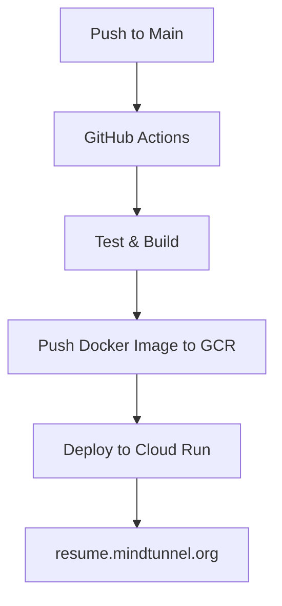

# CloudCV

[](https://github.com/bmarcuche/resume-cloudrun/actions/workflows/deploy.yml)
[](https://github.com/bmarcuche/resume-cloudrun/security)
[](https://resume.mindtunnel.org)

My professional resume site built with **Next.js** and automatically deployed to **Google Cloud Run**.

🌐 **Live Demo**: [resume.mindtunnel.org](https://resume.mindtunnel.org)

---

## 🚀 CI/CD at a Glance



The pipeline runs on every push to `main` and on manual dispatches. GitHub Actions handles testing, building the Docker image, pushing it to Google Container Registry, and deploying to Cloud Run.

On the homepage, a compact diagram illustrates this flow so visitors can quickly see how a commit becomes the running site.

---

## Features

- **Next.js 14** with TypeScript and Tailwind CSS
- **Automated CI/CD** via GitHub Actions
- **Zero-downtime deployments** to Google Cloud Run
- **Security scanning** and vulnerability monitoring
- **Managed SSL** with custom domain
- **Health checks** and automated rollback

## Quick Start

1. **Clone and Install**
   ```bash
   git clone https://github.com/bmarcuche/resume-cloudrun.git
   cd resume-cloudrun
   npm install
   ```
2. **Run Locally**
   ```bash
   npm run dev
   ```
3. **Build for Production**
   ```bash
   npm run build
   ```

## Deployment

1. Create a Google Cloud service account and add the JSON key as `GCP_SA_KEY` in your GitHub repository secrets.
2. Push to the `main` branch to trigger the pipeline. Monitor progress under **Actions**.
3. Once complete, the latest version is available at `https://resume.mindtunnel.org`.

## Technology Stack

- **Frontend**: Next.js, TypeScript, Tailwind CSS
- **Infrastructure**: Google Cloud Run & Google Container Registry
- **CI/CD**: GitHub Actions
- **Monitoring**: Health endpoints and Cloud Run metrics

## Contributing

1. Fork the repository
2. Create a feature branch
3. Make your changes and ensure tests pass
4. Submit a pull request

## License

MIT License - see [LICENSE](LICENSE)

---
**Built with ❤️ by Bruno Marcuche**
